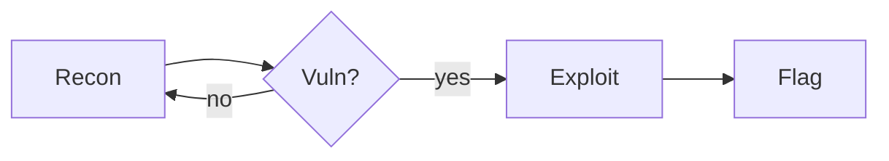
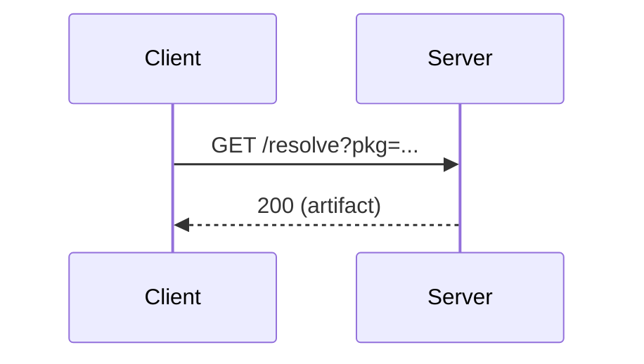

My own reference for writing posts. Every block below shows the **syntax** first,
then what it **renders** to. Not linked anywhere public (`/cheatsheet/` only).

---

## Front matter

Every post/writeup/project/playlist starts with a `---` front-matter block.
Copy one of these and fill it in.

### Normal post — `_posts/YYYY-MM-DD-title.md`

```yaml
---
title: My Post Title
date: 2026-07-16
description: One-line summary used for SEO and link previews.
tags:
  - ctf
  - web
playlists:
  - Daily CTF          # optional; must match a Playlist title exactly
featured: false        # true = highlighted in listings
og_image: /assets/uploads/cover.png   # optional social/preview image
published: true        # false = draft (hidden from the built site)
math: true             # optional; auto-detected if the post contains $$
---
```

### Writeup — `_writeups/title.md`

```yaml
---
title: Schematics 2025 CTF
date: 2026-01-15
description: What the writeup covers.
event: SCH25 CTF Competition     # shown as a chip
team: XxSaktihengkerwibuTzyxX
pdf: /assets/uploads/writeup.pdf  # optional download button
tags:
  - web
  - cryptography
playlists:
  - Daily CTF
featured: false
og_image: /assets/uploads/cover.png
published: true
---
```

### Project — `_projects/title.md`

```yaml
---
title: Project Name
description: One-line description shown on the card.
tech:
  - Jekyll
  - Supabase
repo: https://github.com/you/project
live: https://example.com
readmore: true    # true = card links to a detail page built from the body
order: 1          # lower sorts first
---
```

### Playlist / series — `_playlists/title.md`

```yaml
---
title: Daily CTF
description: Shown on the playlists page and series widget.
featured: false
cover: /assets/uploads/cover.png   # optional thumbnail
order: 1
---
```

---

## Base Markdown

### Headings

```markdown
## Section (h2)
### Subsection (h3)
#### Minor (h4)
```

Use `##` and below in the body — the post title is the `# h1`.

### Text

```markdown
**bold**, *italic*, ~~strikethrough~~, `inline code`, and [a link](https://example.com).
```

Renders: **bold**, *italic*, ~~strikethrough~~, `inline code`, and [a link](https://example.com).

### Lists

```markdown
- unordered
- item
  - nested

1. ordered
2. item
```

### Blockquote

```markdown
> A plain quote.
```

> A plain quote.

### Inline & fenced code

Fenced code blocks get a **language badge** (top-left) and a **copy button**
(top-right) automatically:

````markdown
```python
def solve(flag):
    return flag[::-1]
```
````

```python
def solve(flag):
    return flag[::-1]
```

### Horizontal rule

```markdown
---
```

### Images

A standalone image with alt text becomes a captioned figure (the alt text is
used as the caption, and clicking opens a lightbox):

```markdown

```

Rendered example:


---

## Math (LaTeX)

Inline math with single dollars, display math with double dollars. Escape a
literal dollar amount in prose as `\$`.

```markdown
Inline: $E = mc^2$ and $\gcd(a,b)$.

Display:

$$
x = \frac{-b \pm \sqrt{b^2 - 4ac}}{2a}
$$
```

Inline: $E = mc^2$ and $\gcd(a,b)$.

$$
x = \frac{-b \pm \sqrt{b^2 - 4ac}}{2a}
$$

A crypto-flavoured one:

$$
c \equiv m^{e} \pmod{n} \qquad m \equiv c^{d} \pmod{n}
$$

---

## Callouts

Obsidian syntax: a blockquote whose first line is `[!type]` with an optional
title. Add `-` after the type for a collapsed foldable callout (or `+` for one
that starts open).

```markdown
> [!warning] Heads up
> This payload is destructive — run it in a VM.

> [!tip]
> No title needed; the type is used as the heading.

> [!note]- Collapsible (click to open)
> Hidden until you click.
```

> [!note] Note
> General information worth flagging.

> [!tip] Tip
> A helpful shortcut.

> [!info] Info
> Neutral context.

> [!warning] Warning
> Be careful here.

> [!danger] Danger
> This can break things.

> [!success] Success
> It worked.

> [!question] Question
> Something to consider.

> [!example] Example
> A worked example.

> [!quote] Quote
> A cited line.

> [!bug] Bug
> A known issue.

> [!note]- Collapsible callout
> This body is hidden until you click the header (animated open **and** close).

Callouts **nest** — indent with `> >`:

```markdown
> [!note] Outer
> Some context.
> > [!tip] Nested
> > A tip inside the note.
```

> [!note] Outer
> Some context.
> > [!tip] Nested
> > A tip inside the note.

Aliases render in their colour family:

> [!tldr] TL;DR
> `abstract` / `summary` / `tldr` are the blue family.

> [!error] Error
> `error` / `fail` / `missing` join the red family.

Types (Obsidian aliases map to the same colours): `note`; `abstract`/`summary`/
`tldr`, `info`, `todo`, `question`/`help`/`faq`, `example` (blue); `tip`/`hint`/
`important`, `success`/`check`/`done` (green); `warning`/`caution`/`attention`
(amber); `danger`/`error`/`fail`/`failure`/`missing`, `bug` (red); `quote`/`cite`.

---

## Spoilers

Great for hiding CTF flags or full solutions. Uses raw HTML `<details>`.
Add `markdown="1"` so inline formatting (backticks, bold, etc.) works inside:

```markdown
<details markdown="1">
<summary>Click to reveal the flag</summary>

`CTF{th1s_1s_th3_fl4g}`

</details>
```

<details markdown="1">
<summary>Click to reveal the flag</summary>

`CTF{th1s_1s_th3_fl4g}`

</details>

---

## Highlight

```markdown
Mark text with ==double equals== to highlight it.
```

Mark text with ==double equals== to highlight it.

---

## Task lists

```markdown
- [x] Recon done
- [ ] Exploit written
- [ ] Flag captured
```

- [x] Recon done
- [ ] Exploit written
- [ ] Flag captured

---

## Footnotes

```markdown
Here is a claim with a footnote.[^1]

[^1]: And here is the note itself.
```

Here is a claim with a footnote.[^1]

[^1]: And here is the note itself.

---

## Keyboard keys

```markdown
Press <kbd>Ctrl</kbd> + <kbd>C</kbd> to copy.
```

Press <kbd>Ctrl</kbd> + <kbd>C</kbd> to copy.

---

## Definition lists

```markdown
Term
: The definition of the term.

RCE
: Remote Code Execution.
```

Term
: The definition of the term.

RCE
: Remote Code Execution.

---

## Tables

Tables are centered automatically; wide ones scroll sideways on mobile instead
of breaking the layout.

```markdown
| Category | Solved | Notes        |
| -------- | ------ | ------------ |
| Web      | 3 / 5  | SSTI + IDOR  |
| Crypto   | 2 / 4  | RSA, XOR     |
```

| Category | Solved | Notes        |
| -------- | ------ | ------------ |
| Web      | 3 / 5  | SSTI + IDOR  |
| Crypto   | 2 / 4  | RSA, XOR     |

---

## Mermaid diagrams

Fence a diagram with ` ```mermaid `. Supports flowcharts, sequence diagrams,
and more. Re-themes automatically with light/dark mode.

````markdown

````


A sequence diagram:



---

## Linking other posts (Obsidian-style)

Reference another post/writeup/project by **slug** (the filename without the date
prefix and `.md`). One `[[ ]]` family, three behaviours depending on how you write
it:

| Syntax | Where | Result |
| --- | --- | --- |
| `[[slug]]` | inline in a sentence | a plain text link |
| `[[slug]]` | on its own line | a mention **card** |
| `![[slug]]` | on its own line | a full **embed** (transcludes the body) |

Add `\|collection` for a writeup, project, or playlist — `[[sch25-ctf\|writeups]]`,
`![[mbg-trace\|projects]]`, `[[daily-ctf\|playlists]]`. Default is `posts`.
Mention cards show a type kicker (`post` / `writeup` / `project` / `playlist`).

### Inline link

```markdown
See my [[welcome-to-my-blog]] intro, or a bad one like [[nope]].
```

See my [[welcome-to-my-blog]] intro, or a bad one like [[nope]].

### Mention card (own line)

```markdown
[[daily-ctf-1]]
```

[[daily-ctf-1]]

### Embed (own line)

```markdown
![[welcome-to-my-blog]]
```

![[welcome-to-my-blog]]

A slug that can't be resolved renders in a muted/amber "not found" state so broken
references are easy to spot. Examples inside code fences (like the ones above) are
left untouched.

> [!note] Under the hood
> Cards are still driven by `_includes/post-mention.html`; `[[ ]]` / `![[ ]]` are
> resolved by `_plugins/embed_post.rb`, which only runs under the custom GitHub
> Actions build (not GitHub Pages' native build).

---

### Mention a playlist

```markdown
[[daily-ctf|playlists]]
```

[[daily-ctf|playlists]]

---

## Backlinks ("Mentioned in")

Nothing to write — automatic. Whenever another post/writeup links to this page
with `[[ ]]` or `![[ ]]`, a **Mentioned in** list appears at the bottom of the
target page. Built by the `BacklinkGenerator` in `_plugins/embed_post.rb`.

---

## Images with a set width

Two Obsidian-style forms, both centered as figures:

```markdown
![[diagram.png|500]]        vault image, 500px wide (from /assets/uploads/)
   standard link, 300px wide + caption
```

The `|<number>` is an optional pixel width (capped to 100%). Drop it for full
width. For ``, the text before `|` becomes the caption.

Rendered examples:


![[og-default.png|240]]

---

## Comments

`%%…%%` is stripped from the built page — handy for private drafting notes:

```markdown
Visible text %%this note is removed at build%% keeps going.
```

Visible text %%this note is removed at build%% keeps going.
